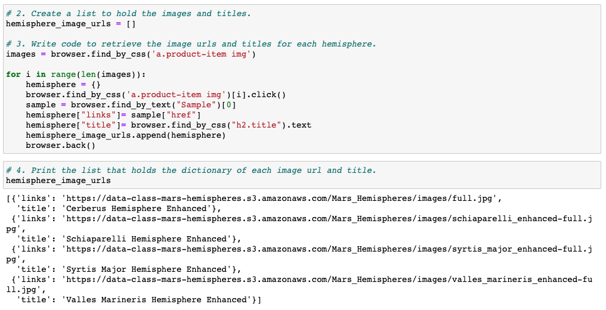

# Mission-to-Mars
Robin a reporter and huge NASA fan has decided to show case her web scraping and html skills.  She admires the images she has seen of Mars's hemispheres and wishes to incorparte these images into her website.  To complete this challenge BeautifulSoup and Splinter were used to scrape full-resolution images and titles.  A Mongo database and Flask app were used to scrape and store all information including image urls so we could place them on Robin's dedicated website.     

## Deliverable 1: Scrape High-Resolution Mars Hemisphere Images and Titles
After inspecting the website for the Mars images, it was determined the best way to collect all 4 images was a for loop. The scrapy.py file contains the functions we created to pull all the important and updated information from different sites Robin follows.  Below is a snap-shot of the code you will find inside the scrapy file.

## Deliverable 2: Update the Web App with Mars Hemisphere Images and Titles

To update the website whenever Robin wants, a Flask app was created. The file name is app.py.  When this app file is run the scrapy.py is imported and the web starts scrapying. We store all data inside a mongo database for recall later.  The main difference in the adjusted scrapy file is to get the 4 high resolution images and titles of the 4 hemispheres.  

## Deliverable 3: Add Bootstrap 3 Components
The final devliverable is adding two Bootstrap 3 components to the index file.  The index file can be found inside the templates folder.  I adjusted two main items for this challenge:
1. Placed all 4 images on a single row.
2. Made the Mars Hemisphere title a Jumbotron text-center class. 

